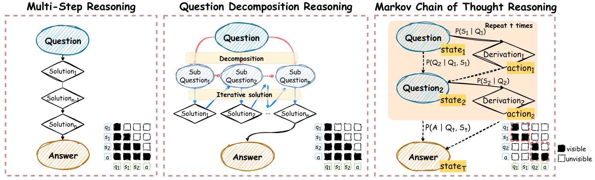
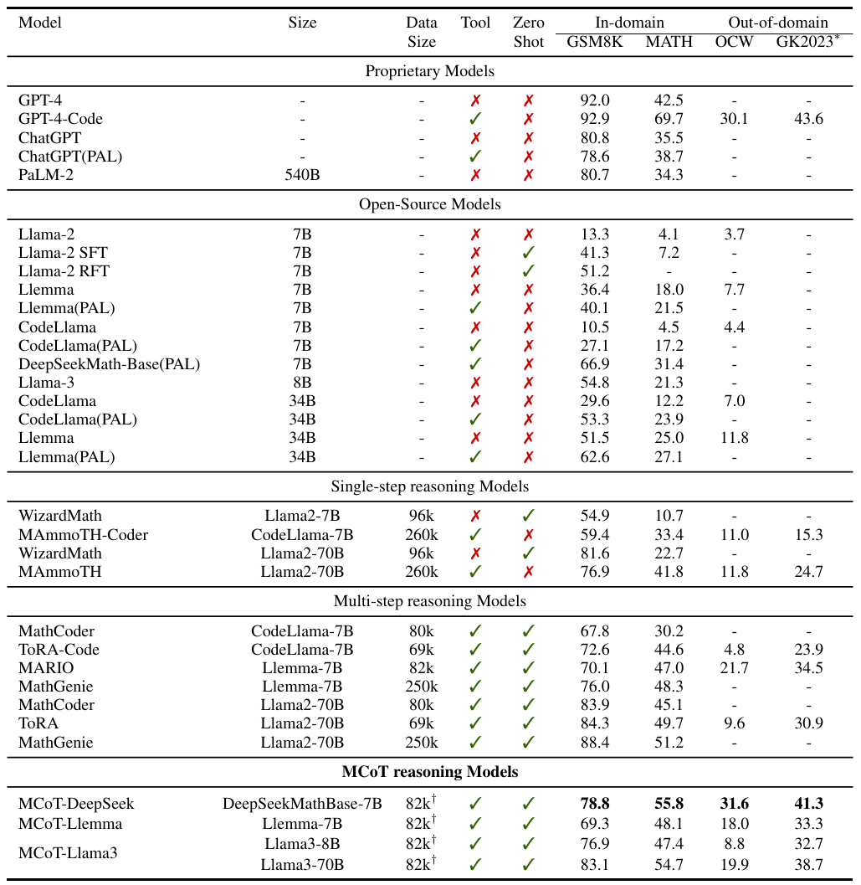
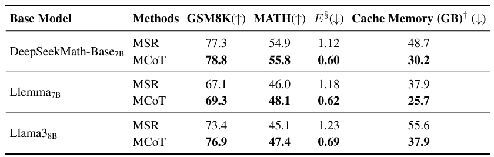
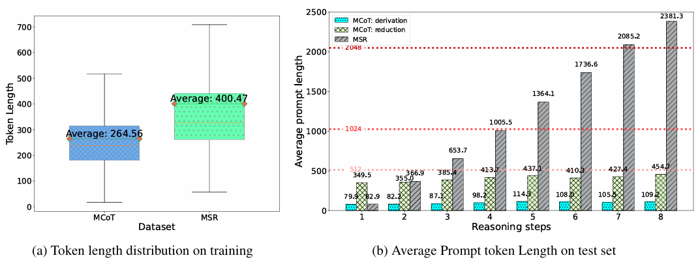
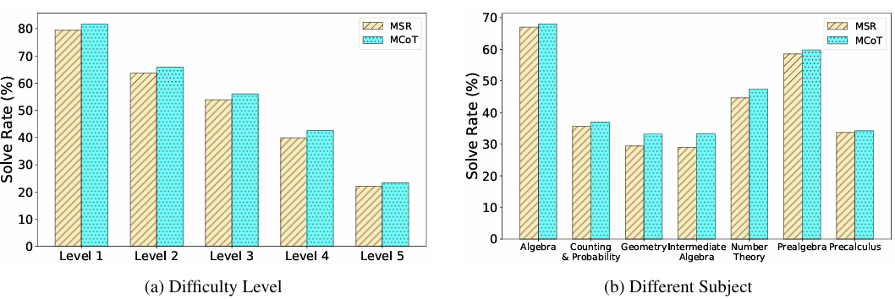

# Markov Chain of Thought for Efficient Mathematical Reasoning

<div align="center">
<br>
<a>Wen Yang</a>, 
<a>Minpeng Liao</a>,
<a>Kai Fan</a>,
<br>

Alibaba Tongyi Lab<br>
    
  <a href='https://arxiv.org/pdf/2410.08964'></a> 
</div>

## 🔖 Overview
Chain of Thought (CoT) of multi-step benefits from the logical structure of the reasoning steps and task-specific actions, significantly enhancing the mathematical reasoning capabilities of large language models. 
As the prevalence of long CoT, the number of reasoning steps exceeds manageable token limits and leads to higher computational demands. 
Inspired by the fundamental logic of human cognition, "derive, then reduce", we conceptualize the standard multi-step CoT as a novel Markov Chain of Thought (MCoT). 

In this study, we consider the mathematical reasoning task, defining each reasoning step as text accompanied by a Python code snippet. 
To facilitate a longer reasoning path, self-correction is enabled through interactions with the code interpreter. 
Our MCoT aims to compress previous reasoning steps into a simplified question, enabling efficient next-step inference without relying on a lengthy KV cache. 
In our experiments, we curate the $\texttt{MCoTInstruct}$ dataset, and the empirical results indicate that MCoT not only significantly enhances efficiency but also maintains comparable accuracy. 
While much remains to be explored, this work paves the way for exploring the long CoT reasoning abilities of LLMs.

<p align="center">
    
</p>

In summary, Our contributions are as follows:

+ We propose an innovative framework Markov Chains of Thought (MCoT), by exploiting the Markov property and envisioning the solution process as a series of transitions between states.

+ We constructed a $\texttt{MCoTInstruct}$ dataset on mathematical reasoning task to facilitate research community. 

+ Extensive experiments demonstrate that, with a maximum number of eight steps, MCoT achieves an average reasoning efficiency that is $1.90\times$ faster than traditional multi-step reasoning and maintains superior to multi-step reasoning accuracy.

As MCoT provides a new pathway for exploring advanced reasoning abilities, we will release our dataset and code to facilitate further research and development within the community. 

## 🔥 Update

- [06/03/2025]🔥We release the [code](https://github.com/ZNLP/Markov-Chain-of-Thought) for Implicit Cross-Lingual Rewarding!
- [05/03/2025]🔥Implicit Cross-Lingual Rewarding is coming! We release the [paper](https://arxiv.org/pdf/2405.15232)!

## 📃 Contents

- [Setup](#Setup)
- [Preparation](#Preparation)
- [Train](#Train)
- [Inference](#Inference)
- [Experiments](#Experiments)
- [Citation](#citation)


## 📷 Setup

Please follow the instructions below to install the required packages.


1. Clone this repository

```bash
https://github.com/ZNLP/Markov-Chain-of-Thought.git
```

2. Install Package

```bash
conda create -n MCoT python=3.10 -y
conda activate MCoT
cd Markov-Chain-of-Thought
pip install -r requirements.txt
```

## 💡 Preparation


```bash
bash scripts/run_construct_mcot_dataset.sh
```

## 📈 Train

Our training is mostly performed on [LLaMA-Factory](https://github.com/hiyouga/LLaMA-Factory) code base. Please refer to that repo for more details.

##  📌 Inference

+ Markov Chain of Thought Reasoning:
```bash
bash scripts/batch_inference_mcot.sh
```
+ Multi-step Reasoning:
```bash
bash scripts/batch_inference_msr.sh
```

## ✅ Evaluation
 
```bash
bash scripts/evaluate.sh
```

## 👀 Experiments

We provide some results in this section. More detailed results can be found in our paper.

### Main Results

+ Main Results on Accuracy
<div align=center>

</div>

+ Main Results on Efficiency
<div align=center>

</div>


### 📊 More Analysis
+ Analysis 1: Efficiency
<div align=center>

</div>

+ Analysis 2: Problem Solving
<div align=center>

</div>


## 🔗 Citation

If you find this repo useful for your research, please consider citing the paper

```
@article{yang2024markov,
  title={Markov Chain of Thought for Efficient Mathematical Reasoning},
  author={Yang, Wen and Liao, Minpeng and Fan, Kai},
  journal={arXiv preprint arXiv:2410.17635},
  year={2024}
}
```

## 🌈 Acknowledgement

We would like to thank the following repos for their great work:

+ [LLaMA-Factory](https://github.com/hiyouga/LLaMA-Factory) for providing the preference optimization framework
+ [Vllm](https://github.com/vllm-project/vllm) for the efficient inference engine with high throughput
+ [transformers](https://github.com/huggingface/transformers) for providing the model-base and fune-tuning framework


## 🔎 License

This project is released under the [Apache 2.0 license](https://github.com/RainBowLuoCS/DEEM/blob/main/LICENSE). Parts of this project contain code and models from other sources, which are subject to their respective licenses.
